# Скрипт создания Google Sheets

> Release Date: 15.09.2020 ver1.5

**Разработчики**
* [Aleksei Goliguzov](https://github.com/MyLibh)  
* [Alex Kristev](https://github.com/kristevalex)  

**Контакты**
* [Telegram](https://t.me/mylibh)

**Содержание**
* [Описание](#s-About)
* [Установка](#s-Install)
* [Требования](#s-Requirements)
* [Запуск](#s-Launch)

##  Описание
Скрипт предназначен для создания Google Sheets ограниченного доступа к одной таблице с общими данными.
Итоговым результатом для каждого элемента таблицы(ученика) будет таблица,
содержащая [шапку](#s-Requirements-Header) и [строку ученика](#s-Requirements-Student-Line).
Обрабатываются все листы таблицы(классы), поддерживается деление класса на две группы, подробнее в и [требованиях](#s-Requirements).

##  Установка
* _**Шаг 0.**_ Скачайте файл скрипта ([link](src/Create-and-share-sheets-to-pupils.gs)) и сайдбара([link](src/sidebar.html))
* _**Шаг 1.**_ Откройте таблицу и нажмите *"Инструменты"*
	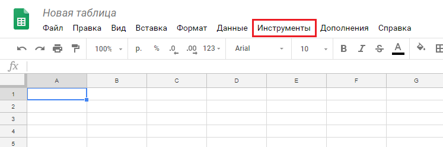
* _**Шаг 2.**_ Выберите *"Редактор скриптов"*
	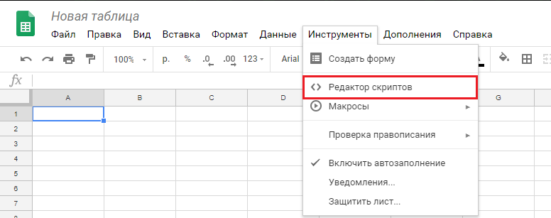
* _**Шаг 3.**_ Переместите файл со скриптом на форму
	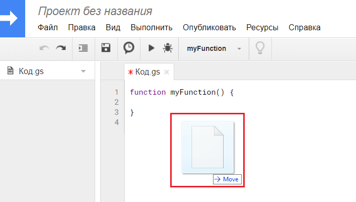
* _**Шаг 4.**_ Сохраните, нажав *кнопку* или *"Ctrl+S"*
	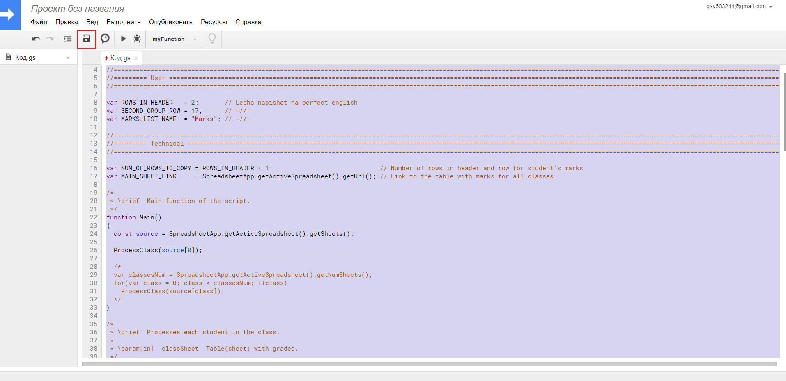
* _**Шаг 5.**_ Придумайте название проекта(например, *"Script"*)
	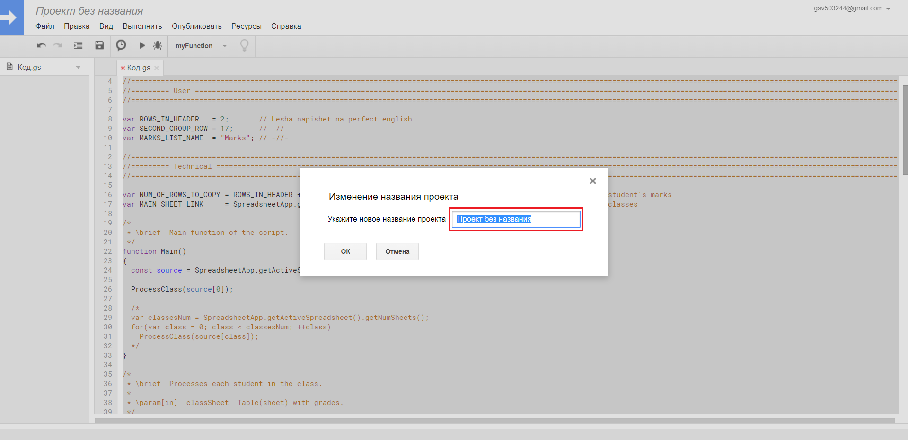
* _**Шаг 6.**_ Нажмите *"ОК"*:
	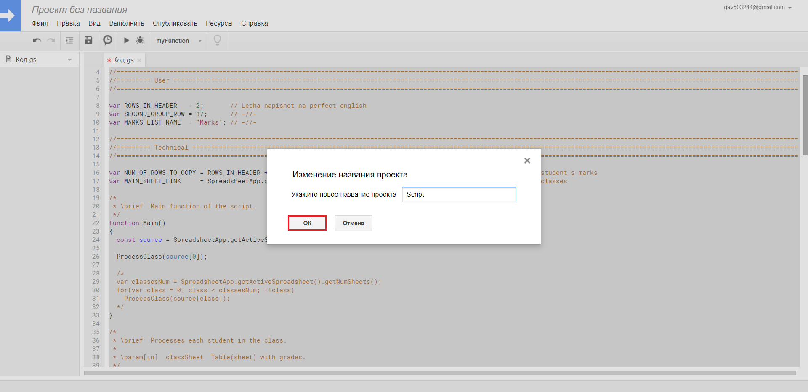
* _**Шаг 7.**_ Нажмите *"Файл->Создать->HTML-file"*
	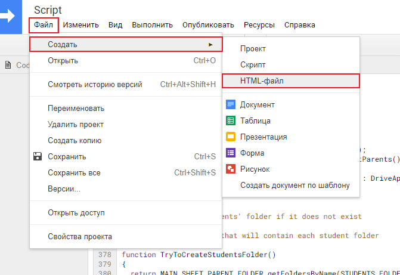
* _**Шаг 8.**_ Назовите *"sidebar"* и нажмите *"ОК"*
	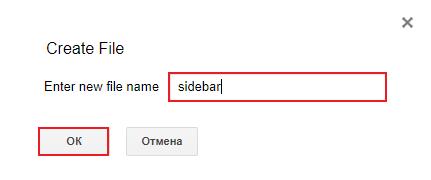
* _**Шаг 9.**_ Переместите файл с сайдбаром на форму (как в *шаге 3*)
	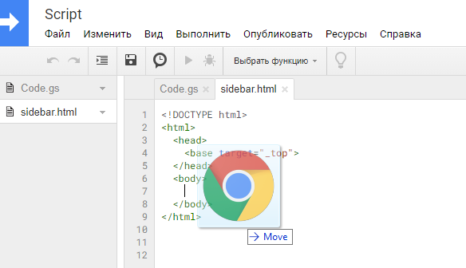
* _**Шаг 10.**_ Сохраните, нажав *кнопку* или *"Ctrl+S"*
	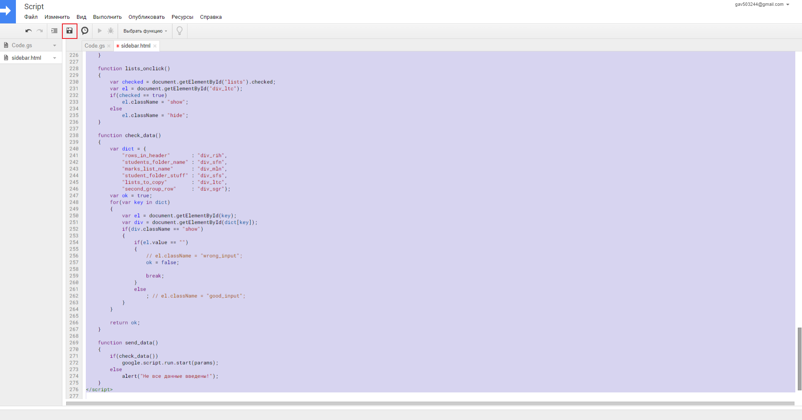
* _**Шаг 12.**_ Вернитесь к таблице и обновите страницу. После обновления(~15-30сек) появится кнопка *Script*
	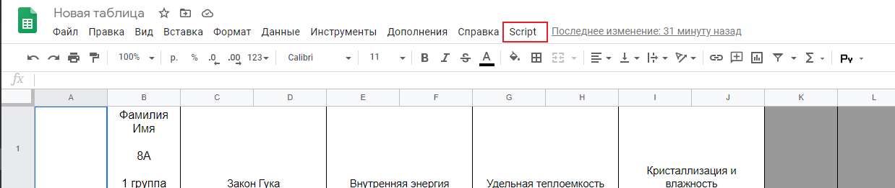

##  Требования
* **Формат группы**
	* Название таблицы ученика будет совпадать с его ФИО(ником), а название папки, в которой она будет находиться, - с названием листа.
	* Каждая группа состоит из шапки и строк учеников:
		
		* *Шапка* - это несколько подряд идущих строк таблицы, содержащие общую информацию для группы.		  
			* *Размер шапки* - количество строк в ней.
			* *Начало шапки* - номер ее первой строки.

		**Важно!** Во втором столбце шапки все ячейки должны быть отдельны, то есть их нельзя объединять.

		* 
		  *Строка ученика* - это строка таблицы, содержащая индивидуальную для ученика информацию(например, оценки).
		  Первый столбец таблицы должен содержать электронную почту учеников, второй - их ФИО(ники).
* **Дополнительно для двух групп**
	Начало 2-ой шапки для всех листов(классов), в которых две группы, должно быть одинаковым.
	В листах(классах) с одной группой, если такие есть, она должна заканчивться раньше, чем начало второй шапки в остальных листах.
* **Общие замечания**
	Размер шапок для всех групп(в том числе и в разных классах) должен быть одинаков.
	Начало 1-ой шапки 1-ой группы должно быть на строке 1.

##  Запуск
* _**Шаг 1.**_ Нажимаете *Script->Sidebar*
	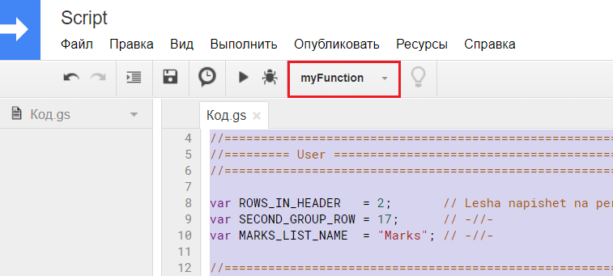
* _**Шаг 2.**_ Разрешите доступ скрипту (в первый раз)
* _**Шаг 3.**_ Справа появится сайдбар с настройками
	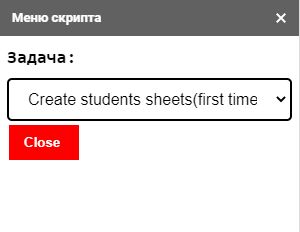
* _**Шаг 4.**_ Поочередно открывайте созданные файлы и разрешайте доступ, нажав на *"Открыть доступ"*
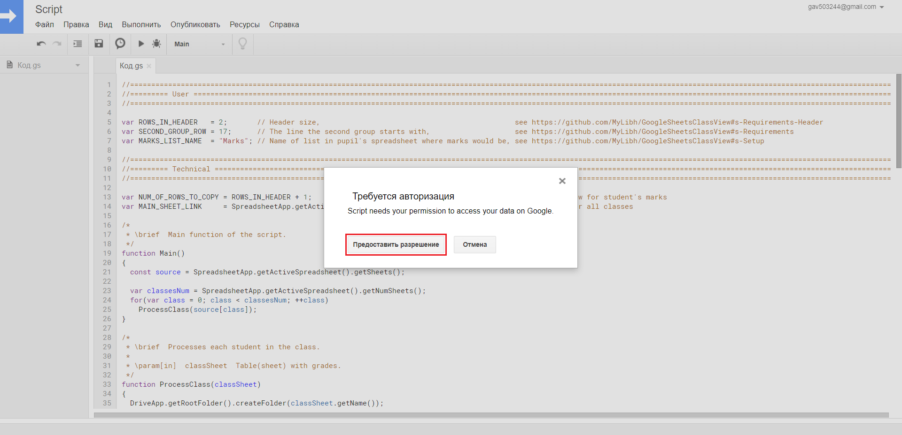
