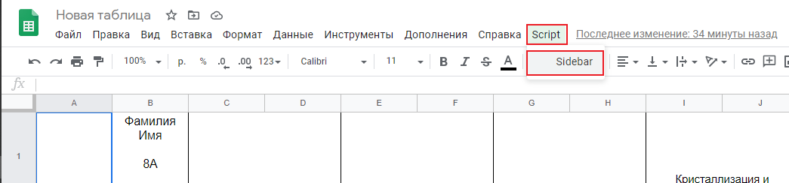

# Скрипт создания Google Sheets
11 ноября 2018

**Разработчики**
* [Aleksei Goliguzov](https://github.com/MyLibh)  
* [Alex Kristev](https://github.com/kristevalex)  

**Содержание**
* [Описание](#s-About)
* [Установка](#s-Install)
* [Настройка](#s-Setup)
* [Требования](#s-Requirements)
* [Запуск](#s-Launch)

## <a name="s-About"></a> Описание

Скрипт предназначен для создания Google Sheets ограниченного доступа к одной таблице с общими данными.
Итоговым результатом для каждого элемента таблицы(ученика) будет таблица,
содержащая [шапку](#s-Requirements-Header) и [строку ученика](#s-Requirements-Student-Line).
Обрабатываются все листы таблицы(классы), поддерживается деление класса на две группы, подробнее в [настройке]() и [требованиях](#s-Requirements).

## <a name="s-Install"></a> Установка

* _**Шаг 1:**_ Скачайте файл [скрипта](src/Create-and-share-sheets-to-pupils.gs)
	```
	git clone https://github.com/MyLibh/GoogleSheetsClassView
	```

* _**Шаг 1:**_ Откройте таблицу и нажмите *"Инструменты"*
	

* _**Шаг 2:**_ Выберите *"Редактор скриптов"*
	

* _**Шаг 3:**_ Переместите файл со скриптом на форму
	

* _**Шаг 4:**_ Сохраните, нажав *кнопку* или *"Ctrl+S"*
	

* _**Шаг 5:**_ Придумайте название проекта(например, *"Script"*)
	

* _**Шаг 6:**_ Нажмите *"ОК"*
	

## <a name="#s-Setup"></a> Настройка

## <a name="s-Requirements"></a> Требования

* **Формат группы**

	* Название таблицы ученика будет совпадать с его ФИО(ником), а название папки, в которой она будет находиться, - с названием листа.

	* Каждая группа состоит из шапки и строк учеников:

		<a name="s-Requirements-Header"></a>
		* *Шапка* - это несколько подряд идущих строк таблицы, содержащие общую информацию для группы.		  
			* *Размер шапки* - количество строк в ней.
			* *Начало шапки* - номер ее первой строки.

		**Важно!** Во втором столбце шапки все ячейки должны быть отдельны, то есть их нельзя объединять.

		* <a name="s-Requirements-Student-Line"></a>
		  *Строка ученика* - это строка таблицы, содержащая индивидуальную для ученика информацию(например, оценки).
		  Первый столбец таблицы должен содержать электронную почту учеников, второй - их ФИО(ники).

* **Дополнительно для двух групп**

	Начало 2-ой шапки для всех листов(классов), в которых две группы, должно быть одинаковым.
	В листах(классах) с одной группой, если такие есть, она должна заканчивться раньше, чем начало второй шапки в остальных листах.

* **Общие замечания**

	Размер шапок для всех групп(в том числе и в разных классах) должен быть одинаков.
	Начало 1-ой шапки 1-ой группы должно быть на строке 1.

## <a name="s-Launch"></a> Запуск

* _**Шаги 1-2:**_ Для запуска необходимо в редакторе скриптов([см. Установка](#s-Install)) выбрать функцию *"Main"*:
	
	

* _**Шаг 3:**_ Запустить скрипт, нажав на *кнопку*
	
